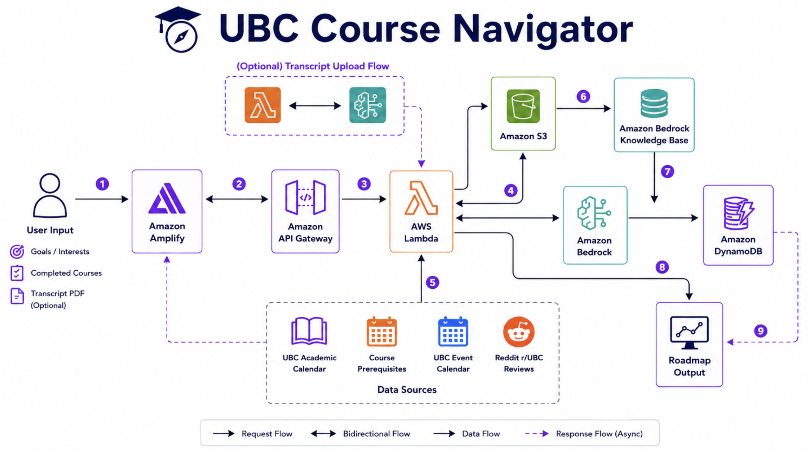

# UBC Course Navigator

**Team Satoori** — UBC CIC Spring 2026 GenAI Hackathon

A personalized course planning tool for UBC Computer Science students, built on AWS. Students describe their career goal in natural language and receive an AI-generated course roadmap grounded in transcript data, official curriculum, and syllabus content via RAG.

---

## The problem

We are UBC BCS students who came into Computer Science as second-degree students, transitioning into tech from other fields. Choosing courses at UBC isn't just about picking what sounds interesting — it determines whether you can unlock upper-level courses, prepare for co-op on time, and actually reach the career path you're aiming for.

But right now, this process is fragmented. Students check the Academic Calendar, compare prerequisites, search for syllabi, read Reddit reviews, and still end up guessing which courses fit their goals.

The question we wanted to answer isn't *"what courses are available?"* — it's:

> **"What should I take next, based on my background and my career goal?"**

---

## Our vision

The user we designed for is someone like **Min-seo** — a second-degree CS student who previously studied biology, now preparing for ML/AI co-op roles. She has completed CPSC 110, CPSC 210, and MATH 101. She's motivated but new to CS, and not sure which courses come next.

Instead of clicking through dropdown menus, she should be able to describe her situation in natural language:

> *"I'm targeting ML/AI roles and want to prep for co-op."*

And get back:
- A personalized recommendation grounded in her transcript and the actual UBC curriculum
- A visual roadmap showing what's completed, available, recommended, and locked
- Course-level context drawn from real syllabi, student reviews, and related events

### Initial architecture plan

<br>



*This diagram represents our complete vision. For the hackathon, we successfully implemented the core AI flow (Lambda ➔ S3 ➔ Bedrock + KB). Please see the 'Future Scope' section below for details on pending integrations.*

---

## What we built

- **Natural language goal input** with career track detection (e.g. "ML engineer" → AI/ML track)
- **PDF transcript upload** with course code extraction via regex (CPSC/MATH/STAT formats)
- **AI-generated recommendations** rendered as a visual prerequisite graph
- **Course node states** — completed, available, recommended, locked
- **Clickable course detail panel** with descriptions and prerequisite chains
- **Knowledge Base RAG** over 54 indexed UBC syllabi — Lambda calls `bedrock_agent.retrieve()` to pull relevant syllabus content before invoking Claude, grounding recommendations in actual course material
- **Three-tier backend resilience** — Lambda → direct Bedrock call → hardcoded JSON fallback

---

## Demo


---

## Architecture

Amazon Bedrock (Claude Sonnet 4.6) is the AI engine. The backend wires together three AWS components around it:

- **AWS Lambda** — serverless function that orchestrates retrieval and Bedrock invocation
- **Amazon Bedrock Knowledge Base** — indexes UBC course syllabi (54 of 61 successfully ingested) for RAG retrieval
- **Amazon S3** — stores `courses.json` and `career_tracks.json`; Lambda fetches these at runtime


```
React (Vite + TypeScript)
    └── API Gateway (Endpoint Management)
            └── AWS Lambda (Orchestrator)
                    ├── Amazon S3 (Course & Career Metadata)
                    ├── Bedrock Knowledge Base (Syllabus RAG)
                    └── Amazon Bedrock (Claude Sonnet 4.6)
```


---

## AWS Services Used

| Service | How it's used |
|---|---|
| **Amazon Bedrock** | Hosts Claude Sonnet 4.6. Invoked by Lambda to generate course recommendations as structured JSON. |
| **Amazon Bedrock Knowledge Base** | Indexes UBC course syllabi (54 of 61 ingested; 7 failed due to PDF parsing issues). Lambda retrieves relevant syllabus snippets via `bedrock_agent.retrieve()` before invoking Claude. |
| **AWS Lambda** | Runs the recommendation logic — KB retrieval, prompt construction, career track hint injection, Bedrock invocation, JSON validation. |
| **Amazon S3** | Stores course metadata. Lambda fetches at runtime so data updates don't require redeployment. |
| **AWS API Gateway** | Exposes the Lambda function as an HTTPS endpoint to the FastAPI backend. |

---

## What we learned

- **Setting up an end-to-end AWS architecture from scratch** — connecting 
  Lambda, API Gateway, S3, Bedrock, and Knowledge Base for the first time
- **Building a RAG pipeline with Bedrock Knowledge Base** — uploading syllabus 
  PDFs to S3, having Bedrock index them as vectors, and retrieving relevant 
  content at query time to ground Claude's responses
- **Writing and deploying Lambda functions** that connect to multiple AWS 
  services (S3, Bedrock) with the right IAM permissions
- **Prompt engineering for structured output** — getting Claude to reliably 
  return strict JSON, and handling cases where it wraps output in markdown 
  fences
- **Working across a 4-person team in parallel** — using git branches to 
  coordinate frontend, backend, AWS, and demo prep without blocking each other

---

## Future Scope & Areas for Exploration

As our first AWS hackathon, building a functional prototype in just 7.5 hours was both a rewarding challenge and a strict limitation. While proud of the core architecture we deployed, time constraints forced us to leave parts of our original vision on the drawing board. Here are the ideal enhancements we look forward to exploring:

* **Live Data Integration (Reddit & Events)** — Currently, student reviews and career events rely on sample data and hardcoded ML events. Our original vision was to transition to live data: using the Reddit API and Amazon Bedrock to summarize real community threads, and dynamically pulling career-matched events from the UBC Events Calendar, Eventbrite, and CS clubs.
* **Enhance Knowledge Base Ingestion Reliability** — Debug and optimize the PDF parsing pipeline to handle edge cases in syllabus formats, improving the current ~90% ingestion success rate.
* **Syllabus Update Strategy** — Exploring a semi-automated update process (e.g., monitoring public UBC department pages) would be a great next step, though it requires further research and technical advice to determine the best approach.
* **DynamoDB for User Sessions** — Integrating DynamoDB to store transcript uploads and conversation history would be an ideal enhancement, allowing students to return and continue their planning seamlessly.
* **Expand beyond CPSC** — Because the current pipeline is department-agnostic, the architecture naturally holds the potential to extend to other UBC departments or even other universities simply by adding new course data and syllabi.

---

## Stack

| Layer | Tech |
|---|---|
| Frontend | React, TypeScript, Vite |
| Backend | FastAPI, Python, boto3, httpx |
| AI | Amazon Bedrock — Claude Sonnet 4.6 |
| Infra | AWS Lambda, S3, API Gateway, IAM, Bedrock Knowledge Base |
| PDF parsing | pypdf |

---

## Local setup

> **Note:** This project requires AWS credentials with access to Bedrock,
> Lambda, S3, and a configured Knowledge Base. The workshop AWS account
> used during the hackathon has since expired. To run locally, you will
> need your own AWS account with these services set up.

**Backend**
```bash
cd backend
python -m venv venv && source venv/bin/activate
pip install -r requirements.txt
cp .env.example .env
uvicorn main:app --reload
```

**Frontend**
```bash
cd frontend
npm install
npm run dev
```

Set `VITE_API_URL=http://localhost:8000` in `frontend/.env.local`.

---

## Team

**Team Satoori** — built at UBC CIC Spring 2026 GenAI Hackathon.
